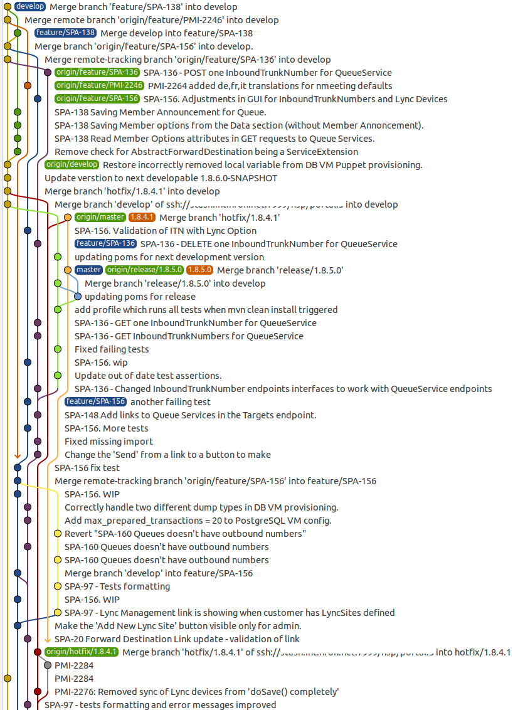
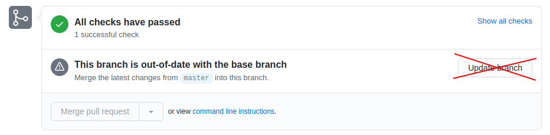

# Git Workflow

Definition of the swisstopo `git` workflow used in github repositories in order to keep the history as clean as possible.

- [Goal](#goal)
- [Branch Model](#branch-model)
  - [Personal branches naming convention](#personal-branches-naming-convention)
- [Long term development: `develop-DESCRIPTION`](#long-term-development-develop-description)
- [Pull Request Rules](#pull-request-rules)
  - [PR for Request For Comment (RFC)](#pr-for-request-for-comment-rfc)
  - [PR Work in Progress](#pr-work-in-progress)
- [Git Workflows](#git-workflows)
  - [Create Personal Branch](#create-personal-branch)
  - [Create PR](#create-pr)
  - [Modify a PR](#modify-a-pr)
  - [Close a PR](#close-a-pr)
- [New release](#new-release)
- [Merge Conflict](#merge-conflict)
  - [1. Conflict in a personal head branch](#1-conflict-in-a-personal-head-branch)
  - [2. Conflict in a shared head branch](#2-conflict-in-a-shared-head-branch)
    - [Merging `develop` or `develop-YYYY-MM-DD` into `master`](#merging-develop-or-develop-yyyy-mm-dd-into-master)
    - [Merging `master` into `develop` or `develop-YYYY-MM-DD`](#merging-master-into-develop-or-develop-yyyy-mm-dd)
    - [Merging `develop` into `develop-DESCRIPTION`$](#merging-develop-into-develop-description)
- [GIT Configuration](#git-configuration)
- [Github repository Configuration](#github-repository-configuration)
- [References](#references)

## Goal

The goal of the following rules and workflow is to avoid such git history


Which can end up quite messy



But to have an history like this


Which is, when we avoid `hotfix`, much easier to read and understand.

## Branch Model

We follow the git flow as in the picture below:


This flow is an adaptation of the original [Git Flow](https://nvie.com/posts/a-successful-git-branching-model/) with some ideas from [Github Flow](http://scottchacon.com/2011/08/31/github-flow.html) and [Gitlab Flow](https://docs.gitlab.com/ee/topics/gitlab_flow.html).

The main branch is `master` and the branches for development are `develop` and `develop-YYYY-MM-DD` (see [Milestone Versioning](VERSIONING_RELEASE.md#milestone-version).

- Everything in `master`, `develop` and `develop-YYYY-MM-DD` branch has production quality
- Directly pushing to `master`, `develop` or `develop-YYYY-MM-DD` is forbidden and should be protected by github branch rule
- `master`, `develop` and `develop-YYYY-MM-DD` are **SHARED** branches
- `push --force` on shared branches is **FORBIDDEN**
- Code on `master` is deployed on PROD and INT
- Code on `develop` or `develop-YYYY-MM-DD` is deployed on DEV
- New features and bug fixes are done on **PERSONAL** branches (see below for [naming conventions](#personal-branches-naming-convention)) and merged in `develop` or in `develop-YYYY-MM-DD`
- Personal branches are owned by the creator and only the owner is allowed to push to it ! This allow the uses of `push --force` on those branches.
- Hot fixe should be avoided, if not avoidable it must be small changes and directly merged into `master`, `develop` or `develop-YYYY-MM-DD`

### Personal branches naming convention

The naming convention below is important for the github actions to work properly !

| Branch | Description |
|--------|-------------|
| `data-JIRA-*` | Personal branch to be merged by PR into `develop-YYYY-MM-DD`. This branch SHOULD have a `JIRA` ticket number and optionally a very short title at the end. This branch contains data integration related work. |
| `feat-JIRA-*`, `feature-JIRA-*` | Personal branch to be merged by PR into `develop` or `develop-YYYY-MM-DD`. This branch SHOULD have a `JIRA` ticket number and optionally a very short title at the end. This branch contains non data integration related work that should be done for the next release. |
| `bug-JIRA-*`, `bugfix-JIRA-*` | Personal branch to be merged by PR into `develop` or `develop-YYYY-MM-DD`. This branch SHOULD have a `JIRA` ticket number and optionally a very short title at the end. This branch contains bugfix related work that should be done for the next release. |
| `hotfix-JIRA-*` | Personal branch to be merged by PR directly into `master` and will be deployed as hot fix. Note here the JIRA ticket might be optional if there is no JIRA ticket related to the bug fix. |

**NOTES:**

- **Prefix in branch names are important in order to set the correct PR label for release note categorization!**
- **JIRA ticket number in branch is important in order to link the branch to the JIRA ticket !**
- **Git commit should also have the JIRA ticket number in the title for the linking !**

## Long term development: `develop-DESCRIPTION`

In case of a long term development, we should avoid working weeks or even worse months long on a single PR
creating at the end a huge PR to review. Review of huge PR is not efficient and often of bad review quality
(missing important points). To avoid this and still keep the branch rules defined above (`master` and
`develop` branches have production and working quality codes), we can create a third shared branch;

```text
develop-DESCRIPTION
```

where `DESCRIPTION` is a meaningful short description that can be easily understood (for example `develop-refactor-drawing`, `develop-migration-frankfurt`).

This branch must then follow these rules:

- Must be created from `develop`
  - for milestone workflow repository (e.g. `mf-chsdi3`) then we have two use cases
    1. The development is done within a few to several weeks and is to be completed before the end of the current milestone. The work is data integration related.
         - `develop-DESCRIPTION` is created from `develop-YYYY-MM-DD` branch
         - `develop-DESCRIPTION` is to be merged into `develop-YYYY-MM-DD` branch at the end.
    2. The development spanned accross several milestones and is not really data integration related
         - `develop-DESCRIPTION` is created from `master`
         - `develop-DESCRIPTION` is merged into `master` at the end
- `develop-DESCRIPTION` is a shared branch where several developer can work on it and **MUST** have github branch rule set accordingly.
  - Directly pushing to `develop-DESCRIPTION` is forbidden and should be protected by github branch rule
  - All PRs to `develop-DESCRIPTION` must be peer reviewed before merging (protected by github rule)
- New features/bug fixes are done on **PERSONAL** branches (see below for [naming conventions](#personal-branches-naming-convention)) and merged into `develop-DESCRIPTION` via reviewed PRs.
- Personal branches are owned by the creator and only the owner is allowed to push to it ! This allow the uses of `push --force` on those branches.
- PRs to `develop-DESCRIPTION` code might not be working and might make the unit test failing, but still needs to have productive/clean code.
- TODO in `develop-DESCRIPTION` PRs are allowed.
- All other PR rules defined below in [Pull Request Rules](#pull-request-rules) are still valid (except of the two points mentioned just above)
- `develop-DESCRIPTION` branch needs to be regularly updated from its upstream branch; create a PR to merge `develop` into `develop-DESCRIPTION`
- Once `develop-DESCRIPTION` has reached a fully working productive state, it can be merged back into its upstream branch; create a PR to merge `develop-DESCRIPTION` into `develop` and once merged delete `develop-DESCRIPTION`

## Pull Request Rules

- Pull requests should only be created if the changes in the `feature|bugfix|hotfix` branch is **ready** to be discussed/reviewed/merged. Exception to the rules are PR for RFC (see [PR for Request For Comment (RFC)](#pr-for-request-for-comment-rfc)).
- A PR should be of **production** quality
- A PR has a proper title. The title MUST contain the JIRA related ticket number if any (`PB-9999: ...`).
- A PR Title should reflect the changes and be written in past tense. Title is used to generate the Release Note !
- A PR is only assigned for review when it's **finished** and not WIP anymore, all commits must be **ready** for review (see below)
- A PR contains atomic and well named commits:
  - Each commit should have a comment in the following forms

    ```text
    <jira-issue-id>: Title (should not be more than 100 chars)

    Description of the issue being fixed by the commit. Eventually how the issue could be reproduced.

    Description of the solution to the issue that is being fixed.
    ```

  - if you have too many commits in your PR, **squash** them before assigning the PR for review
- A PR addresses a well described and well documented issue
- A PR describes the changes that are introduced and mentions possible side-effects for testing
- A PR describes the necessary steps to undertake before merging (infrastructure, data, varnish, etc.)
- A PR provides a test link - and if that's not possible describes how it can be tested
- PR must be **peer-reviewed** (unless changes are trivial). This applies to everything under version control (code, scripts, config, SQL,...). Try to review quickly if your review is requested.
- EVERY Developer is responsible to periodically checks his review requests (using email notification and/or the github [Pull Request page](https://github.com/pulls/review-requested)) and to answer them ASAP, in order to not slow down development.
- PR must be merged with merge commits. This keeps the original commit hashes, adds a dedicated merge-commit and makes it easier to figure out which commits have been merged in which branches (no `fast forward` merge).
- **Avoid** changing commits after review (avoid _squash_, _split_ or _rewrite_), do new commit to apply the requested changes by the reviewer.
- PR must be **up to date** before merge, do a `git rebase` before merging.

    ```bash
    git fetch origin
    git rebase origin/develop # or origin/master
    git push --force origin PR_BRANCH
    ```

- **Don't use** the `Update Branch` Github button, use git CLI instead (see above).
  
  Alternatively you can use the `Update with rebase` Github button 
- Work is considered done, if a PR is **merged** (not when it's created)

### PR for Request For Comment (RFC)

PR can be used for starting a discussion as RFC. In this case the first rule can be ignored, but you need then to follow these ones:

- PRs for RFC must have `RFC` label and must be marked as `Draft`.

  

- Git commit don't requires propers message as the PR is in draft mode
- Once the RFC has ended, there is the following two possible flow:
  1. The PR is closed with a comment. Nothing gets merged!
  1. The PR is ready for review.
      - This imply to first remove `RFC` label
      - Then make sure that the PR follows the [Pull Request Rules](#pull-request-rules) above
      - Finally remove it from `Draft` mode by clicking on `Ready for Review` button

      

### PR Work in Progress

PR could be used to test the code on CodeBuild (usually only needed when setting up CodeBuild):

- PRs for WIP must have `WIP` label and must be marked as `Draft`.

  

- Git commit don't requires propers message as the PR is in draft mode
- Once the WIP has ended, there is the following two possible flow:
  1. The PR is closed with a comment. Nothing gets merged!
  1. The PR is ready for review.
      - This imply to first remove `WIP` label
      - Then make sure that the PR follows the [Pull Request Rules](#pull-request-rules) above
      - Finally remove it from `Draft` mode by clicking on `Ready for Review` button

      

## Git Workflows

This workflow refers to SemVer versioning, for milestone simply replace `develop` by `develop-YYYY-MM-DD`.

### Create Personal Branch

1. Update the `develop` branch

    ```bash
    git checkout develop
    git pull  # git pull origin develop
    ```

1. Create and checkout your personal branch named according to the [convention](#personal-branches-naming-convention).

    ```bash
    git checkout -b PRIVATE_BRANCH # git branch PRIVATE_BRANCH; git checkout PRIVATE_BRANCH
    ```

1. Do your work and push it to the server

    ```bash
    git add .
    git commit -m "did something"
    git push origin PRIVATE_BRANCH # NEVER EVER DO `git push` always specify the destination `origin` and source
    ```

### Create PR

1. Update first your personal branch

    ```bash
    git checkout PRIVATE_BRANCH
    git fetch origin develop:develop # git fetch origin master:master
    git rebase origin/develop
    # or for master PR
    git rebase origin/master
    ```

1. Eventually re-organize, squash or rewrites your commits to have them production ready

    ```bash
    git rebase -i origin/develop
    # or
    git rebase -i origin/master

    # then push the new commits
    git push --force origin PERSONAL_BRANCH # force push on personal branch is allowed
    ```

1. Login into Github and navigate to the repo in order to create the PR (follow the [Pull Request Rules](#pull-request-rules) above)
1. Assign one or more reviewer

### Modify a PR

Once a PR has been created, some modification might be requested by peers (reviewer).

1. Create new commits and push them back to your personal branch (PR branch)
1. Eventually update the PR branch with `git rebase origin/develop|origin/master`
1. Re-request a review of your changes

### Close a PR

Once a PR has been approved do as follow

1. Make sure that the PR is up to date

    ```bash
    git fetch origin develop:develop
    git rebase -i origin/develop
    # or
    git rebase -i origin/master

    # then push the new commits
    git push --force origin PRIVATE_BRANCH
    ```

1. Then merge the PR to `develop` or `master`. This should be done from Github and not from the CLI

1. Finally do some clean up actions: delete your local PR branch as well as the remote PR branch (if not automatically done)

    ```bash
    git branch -d PRIVATE_BRANCH
    ```

## New release

See [Versioning and Release](./VERSIONING_RELEASE.md)

## Merge Conflict

When trying to merge a PR, conflict might occur. There is 2 type of conflicts that needs to be dealt differently.

### 1. Conflict in a personal head branch

When merging a personal branch into a shared branch (e.g. `feat-my-feature` into `develop`), we should
never have conflict as the head branch should be always rebased on top of the base branch. Due to this
conflict always happens during the rebase and needs to be fixed during the rebase step on the personal branch.

### 2. Conflict in a shared head branch

When merging two shared branches, conflict might occurs and we can't directly fix them on a shared
branch has we have a PR policy.

#### Merging `develop` or `develop-YYYY-MM-DD` into `master`

In this case we should never have any conflict because should always keep `develop*` up to date by
merging `master` into `develop*` (this is only needed when hotfixes have been merged into `master`).

#### Merging `master` into `develop` or `develop-YYYY-MM-DD`

When hotfixes have been merged into `master` then need to be added as well on the `develop*` branch.
For this we create a PR to merge `master` into `develop*`.

:warning: Only admin user can merge those PR as due to the branch protection of develop, the PR will
be block due to the `This branch is out-of-date with the base branch` warning. Due to the nature of
our git flow `master` branch can be out of date based on `develop` and in this special use case admin
are allow to bypass the branch protection. See [github.com/orgs/geoadmin/teams/pp-bgdi-admin](https://github.com/orgs/geoadmin/teams/pp-bgdi-admin)
to see who is currently admin.

In this case conflict might occur ! To solve them procede as follow:

1. First open a PR to merge `master` into `develop` or `develop-YYYY-MM-DD`
2. Then if the PR can't be merge do to conflict, checkout both branch locally (make sure that both branch are up to date with their origin)

    ```bash
    git checkout master
    git pull
    git checkout develop
    git pull
    ```

3. Then manually merge `master` into `develop`

    ```bash
    git merge master
    ```

4. Solve the merge conflict using the merge tool (at best with Beyond Compare)

    ```bash
    git mergetool
    ```

5. Once all conflict have been resolved, commit the mergeconflict changes, it is a best practice to put
the files that had conflict in the merge commit message. For this simply uncomment the conflicts line in the
automatic commit message.

    ```bash
    git commit
    ```

6. Finally, push the merge. Before this make sure that the PR open in step 1. has been approved, otherwise you won't be able to merge !

    ```bash
    git push origin develop
    ```

#### Merging `develop` into `develop-DESCRIPTION`$

Follow the same step as in [Merging `master` into `develop` or `develop-YYYY-MM-DD`](#merging-master-into-develop-or-develop-yyyy-mm-dd)

## GIT Configuration

In order to have a proper git history, each developer MUST HAVE the following git configuration

```bash
$ git config --global --list
...
user.name=<developer-full-name>
user.email=<developer-email>
merge.ff=false
pull.rebase=true
...
```

To edit the config do:

```bash
git config --global --add user.name <full-name>
git config --global --add user.email <email>
git config --global --add merge.ff false
git config --global --add pull.rebase true
# or
$ git config --global --edit
...
[user]
  name = <full-name>
  email = <email>
[merge]
  ff = false
...
```

This ensure that a commit has a proper author and that the default behavior for merge is a non fast forward.

## Github repository Configuration

- Each github repo MUST BE configured to enforce PR review.
- Each github repo MUST DISALLOW the PR Merge if the PR is **not up to date**.
- Each github repo configuration MUST BE managed by Terraform, see [geoadmin/infra-terraform-github-bgdi](https://github.com/geoadmin/infra-terraform-github-bgdi)

## References

Here below are the reference list for the flow:

- [“A successful Git branching model” by Vincent Driessen](https://nvie.com/posts/a-successful-git-branching-model/)
- [“GitHub Flow” by Scott Chacon](http://scottchacon.com/2011/08/31/github-flow.html)
- [“Introduction to GitLab Flow” by GitLab](https://docs.gitlab.com/ee/topics/gitlab_flow.html)
- [“GitFlow considered harmful” by Adam Ruka](http://endoflineblog.com/gitflow-considered-harmful)
- [“OneFlow — a Git branching model and workflow” by Adam Ruka](http://endoflineblog.com/oneflow-a-git-branching-model-and-workflow)
